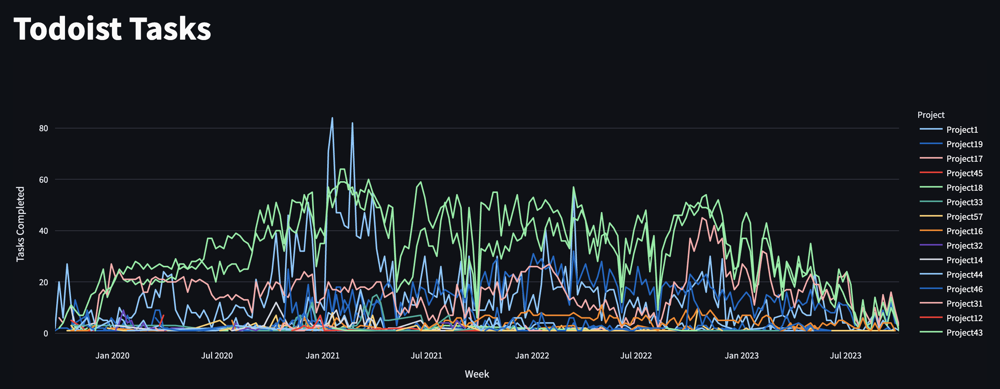

# ProgressTracker
Local app for Todoist progress visualization, using Streamlit, DuckDB, and Plotly.

## Setup
Note: (Currently this app is only for personal use, so I haven't made easy-to-use setup steps). The rough setup steps are outlined below:

- Install dependencies:
```
pip3 install streamlit duckdb plotly
```
- Setup Todoist API token, following instructions [here](https://todoist.com/help/articles/find-your-api-token).
- Create a file `.todoist_api_token` with contents (`export TODOIST_API_TOKEN=<YOUR_API_TOKEN>`).
- Update `todoist.rc` with you own project source directory and desired database location.
- Run `source todoist.rc`
- Run `todoistInit && todoistSync` to initialize your database.
- Run `todoistDisplay` to see a visualization of your Todoist statistics.
- Whenever necessary, run `todoistSync` again to sync recently completed tasks.

## Display
Ouput looks like the below image (fake project names have been provided in this example):


